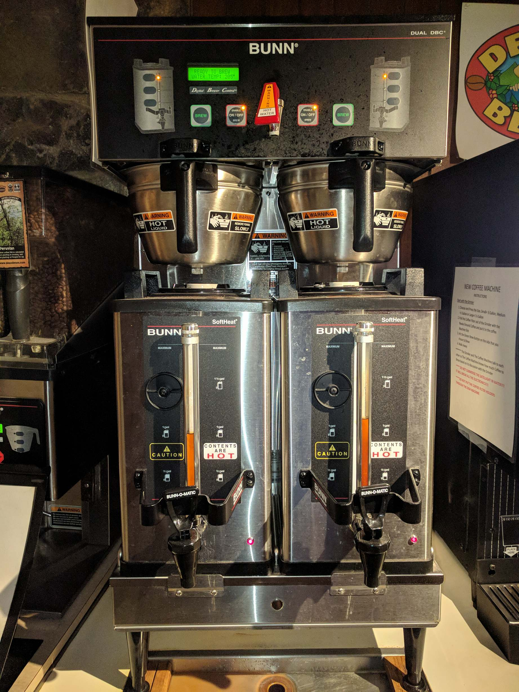

This is the coffee and hot water dispenser in Driscoll dining hall. The two
black valves at the bottom dispense coffee. The red valve at top releases hot
water, at claimed 205° (Fahrenheit, one assumes), suitable for making tea, or
maybe hot cocoa.

I don't think there's any placement of this machine that would actually make
sense. Since the liquids being dispensed are the temperature of boiling water,
it is highly desirable to be able to look down into the opaque cups usually
used for holding hot beverages while filling them, so that one does not
overfill a cup and spill boiling water all over one's hands. Unfortunately, at
the height the machine is placed (with the sign at the side at about eye
level), one would need to be very tall to be able to see into one's cup while
filling it.

On the other hand, even if the machine were placed lower, so that the hot water
is accessible, the coffee valves would be very close to the ground, and would
be uncomfortable for a person of ordinary height to use.

It's probably a bad idea to install this sort of machine sideways.

I don't see any way to install this machine so that both coffee and water can
be dispensed at a reasonable height. The three valves should've been placed at
about the same height.
