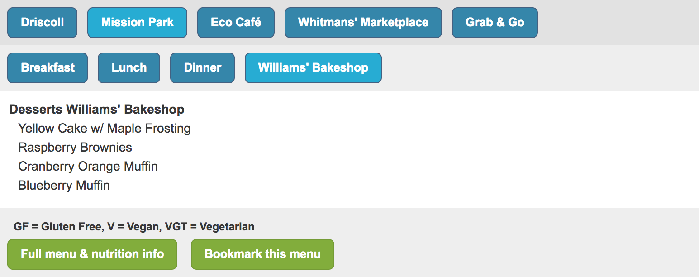

On page load

Click "Mission Park"

Click "Williams' Bakeshop"

Click "Driscoll"

Click "Whitmans' Marketplace"

Notice that as the upper-level selection is changed, the lower-level selection
remains on "Williams' Bakeshop" without requiring reselection.

To put it another way, this fixes the really common issue where redoing a
higher-level selection requires redoing all lower-level selections, which makes
it tedious to compare the food being offered at multiple locations in the
common case: for deciding which dining hall one wants to walk to right now,
based on what food is being served.

With this relatively new design, switching the location selection keeps the
same meal selection, so it's possible to compare changing only the location.
