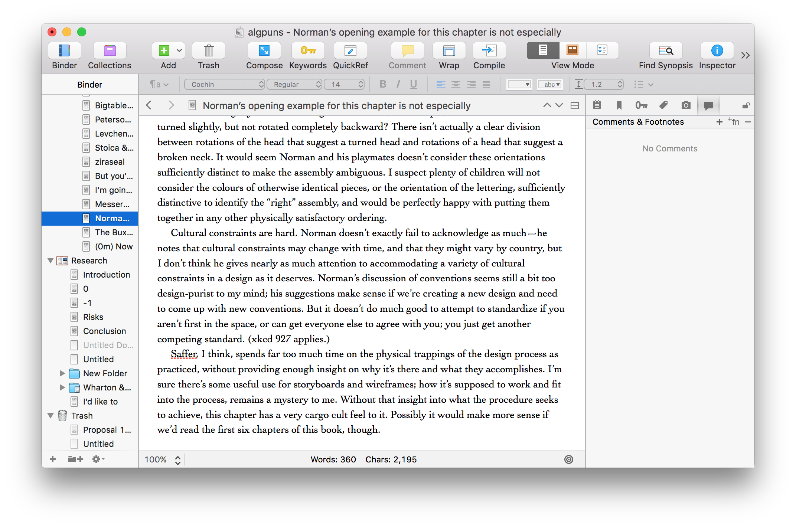
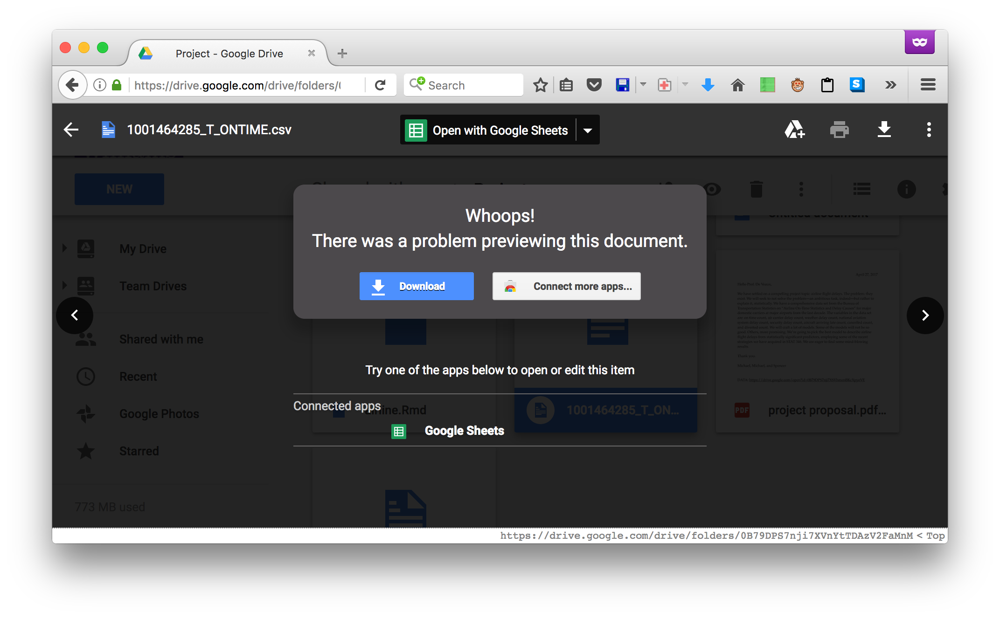

### Background

About three years ago, I bought a license for Scrivener, and have since written
up almost all of my papers that don't require math typesetting in it.

It is not an especially good word processor. In fact, it's kind of terrible as
a word processor and is geared mainly toward writing mostly-plain text. Its
distinguishing feature is that, rather than working on a single document, it
effectively manages a written work as a project, like in an IDE, with support
for building the output document from multiple internal files, and accomodates
storing various metadata, notes, arbitrary related files &c. in the project.

This can be helpful when working alone, but groupwork _especially_ demands this
sort of organizational aid to keep track of what's being done on a project.
Unfortunately, nothing similarly useful and accessible (to ordinary users)
exists among collaborative software offerings.

Some issues with existing services:

- only deals with a single document, without a good way to add metadata or
  attach related data (e.g. Google Docs). Many projects would benefit from
  being able to attach data files or even just a graph/photo/figure that should
  go in the document somewhere, but without deciding the precise placement
  until cleaning up the draft for publication.
- rely on an explicit check-in/update workflow (hosted VCS, e.g. git). This
  only makes sense when we have either discrete changes or numbered drafts.
  It's impossible to edit a file _together_, only make separate changes and
  hope that the results don't conflict and require an arcane merge procedure.
- only deals with downloading/uploading files, without providing an editor
  (e.g. Google Drive). This is here only because it sort of integrates with
  Google Docs to provide a way to organize related files, but the integration
  is awful and nigh-useless.
  

The collaborative editor element seems to be very poorly explored, while almost
all project management tools marketed to individuals (rather than B2B) are only
suitable for source code, perhaps because the only people who write these
things are mostly interested in code.

The only service that seems to fill a similar niche is ShareLaTeX/Overleaf, and
their product is focused on providing a TeX environment in the browser moreso,
and so caters to a rather specific audience.

As a result, in my experience, groupwork that needs to produce a written
artifact usually either

- doesn't get done without meatmeetings
- involves emailing things around
- involves emailing _links to Google Docs_ around
- the above, except with increasingly desperate Facebook messages instead of
  email, past midnight on the due date

### Proposal

Build a web application for interactive collaboration on a written project.
Basic requirements are file storage and organization tooling, a collaborative
editor, export to a common format, and audit logging.

Beyond that, the application should provide functionality useful to writing up
an article/paper/novel, like referring to reference sheets, or making it easy
to look up earlier mentions of a term/name/reference. A lot of this is actually
very similar to what an IDE does, but in a natural language context. It doesn't
necessarily have to be very smart to be useful, though.

### Ulterior Motives

I spend a lot of time around amateur translation groups. Version control
doesn't get used because it's too hard, and a lot of workflows involve
copy-pasting scripts around collab tools with subtly different capabilities
and/or defaults. A lot could be improved by software that better fits the use
case than already exists.
